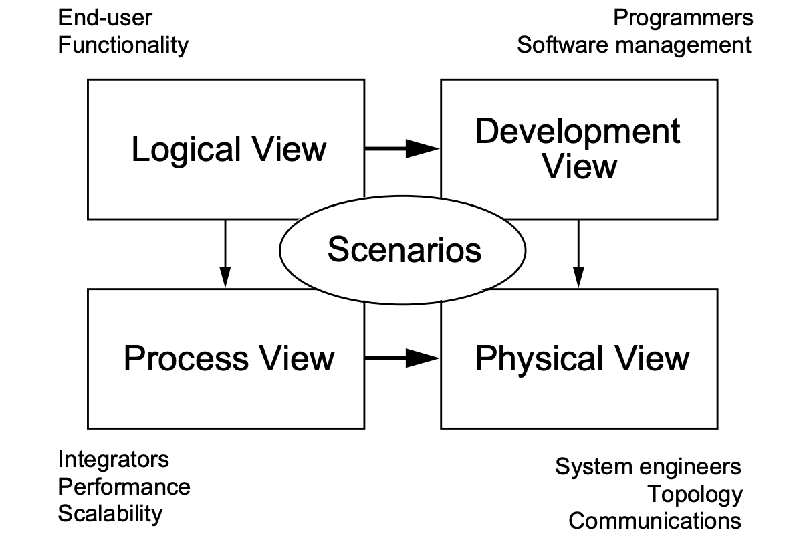

# Software Architecture Document [Case Study]

# Luxury Fashion House (_Luxurion_)

- [Software Architecture Document [Case Study]](#software-architecture-document-case-study)
- [Luxury Fashion House (_Luxurion_)](#luxury-fashion-house-luxurion)
- [Introduction](#introduction)
  - [Purpose](#purpose)
  - [Scope](#scope)
  - [Definitions](#definitions)
- [Architectural Representation](#architectural-representation)
  - [Architectural Goals and Constraints](#architectural-goals-and-constraints)
  - [Use-Case View](#use-case-view)
  - [Logical View](#logical-view)
  - [Process View](#process-view)
  - [Data View](#data-view)
  - [Deployment View](#deployment-view)
  - [Implementation View](#implementation-view)
  - [Size and Performance](#size-and-performance)
  - [Quality](#quality)

# Introduction

This document provides a high level overview and explains the architecture of the Luxury Fashion House e-commerce solution - **Luxurion**. 

The document defines goals of the architecture, the use cases supported by the system, architectural styles and components that have been selected. The document provides a rationale for the architecture and design decisions made from the conceptual idea to its implementation.

## Purpose

The Software Architecture Document documents and tracks the necessary information required to effectively define architecture and system design in order to give the development team guidance on the architecture of the system to be developed. It presents a number of different architectural views to depict different aspects of the system.  It is intended to capture and convey the significant architectural decisions which have been made on the system.

In order to depict the software as accurately as possible, the structure of this document is based on the [“4+1” model](http://www3.software.ibm.com/ibmdl/pub/software/rational/web/whitepapers/2003/Pbk4p1.pdf) view of architecture.

_The “4+1” View Model allows various stakeholders to find what they need in the software architecture_

## Scope

The scope of this SAD is to explain the architecture of the Luxurion

This document describes the various aspects of the Luxurion system design that are considered to be architecturally significant. These elements and behaviors are fundamental for guiding the construction of the Luxurion system and for understanding this project as a whole. 

## Definitions

- **SAD**: Software Architecture Document
- **API**: Application Programming Interface

# Architectural Representation

## Architectural Goals and Constraints

There are multiple Goals and Contrains are available, however, the key important ones are listed below.

* Payments: the solution accepts two types of payments:
    * Online: payments made through the online store. These payments require validation by a third party payments provider (think Stripe, PayPal, etc.).
    * Offline: payments made in the physical store. These don’t require validation as they are pre-validated on-site by the clerks (i.e. made in cash).

* Performance:
  * During peak shopping seasons (i.e. Christmas) the company expects a high volume of transactions, peaking at hundred of thousands requests per second (most of them being read requests). The type of datastore/strategy chosen must be capable of handling such volumes without affecting the user experience.
  * The biggest markets for the company are Europe and Asia. The solution must provide the best service possible for customers in both regions.

* Analytics: top executives of the company should be able to get insights about key metrics like sales, products' performance, customers, etc. The architecture should take this into account. 

* Observability: support engineers should have a good view on how the system is performing, be able to identify key issues within the system (for instance failed payments), have events logs, etc.

* Security / Privacy: The system contains payment data as well as sensible data from customers. We need to ensure that all the data is well secured.

## Use-Case View

- Registration
- LogIn 
- Add to Cart
- Pay Online
- etc.

Each and evry use case might come along with the sequence diagram for better visibility/readability.

## Logical View

In this section we need to describe the main components/modules/services and they way how they will communicate with each other

## Process View

That section takes into account some non-functional requirements, such as performance and availability. It addresses issues of concurrency and distribution, of system’s integrity, of fault-tolerance, and how the main abstractions from the logical view fit within the process view which thread of control is an operation for an object actually executed.

Describes the system's decomposition into lightweight processes (single threads) and heavyweight processes (background jobs/tasks). 

## Data View

That section suitable for ER (Entity Relation) Diagram.

## Deployment View

This section is a great place for describing the mapping of the software onto the hardware. Describe one or more physical network (hardware) configurations on which the System runs. It also describe deployment structures, by including known and anticipated deployment scenarios in the architecture. 

## Implementation View

Describes the overall structure of the implementation model, the decomposition of the software into layers and subsystems in the implementation model, and any architecturally significant components. Including Classes Digram

## Size and Performance

Here we need to define the KPIs for the performance of the entire System. Transactions per second. CPU, Mem, I/O and Network In/Out load.

## Quality

This section describes how the software arxhitecture impacts/contributes to all capabilities of the system: extensibility, reliability, portability and others.